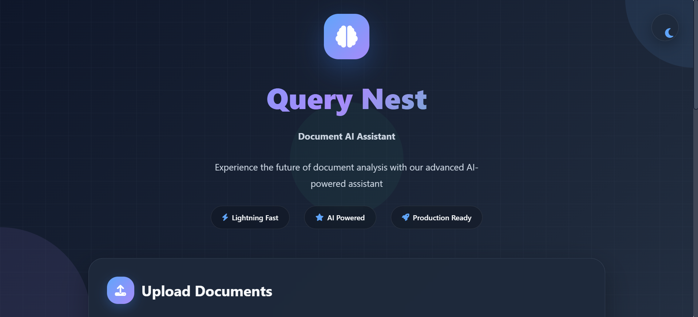
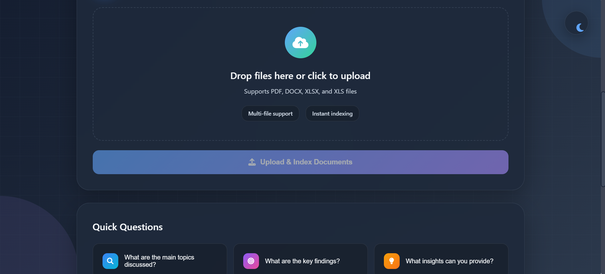
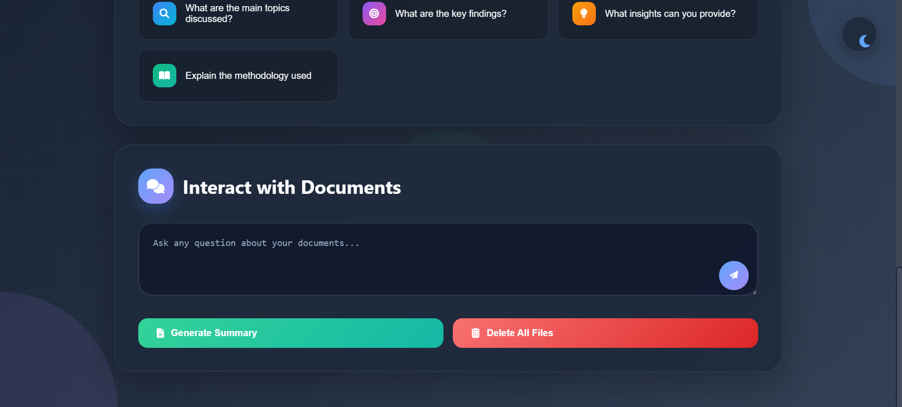
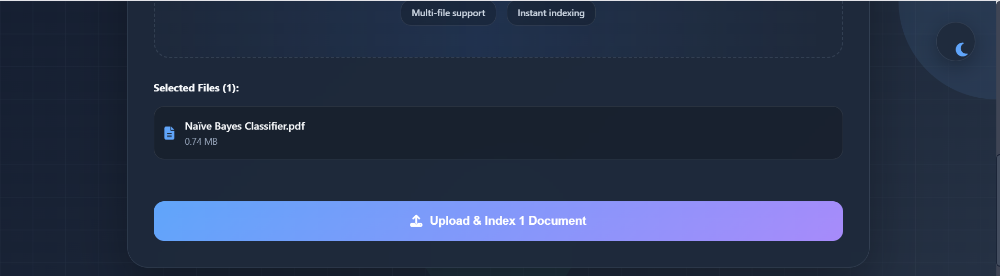
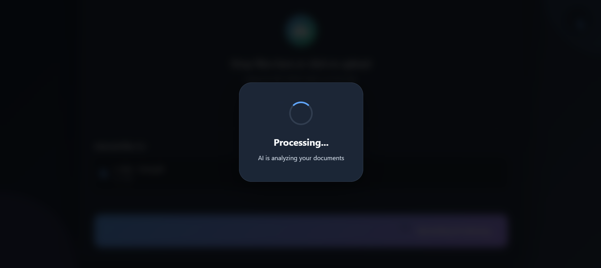
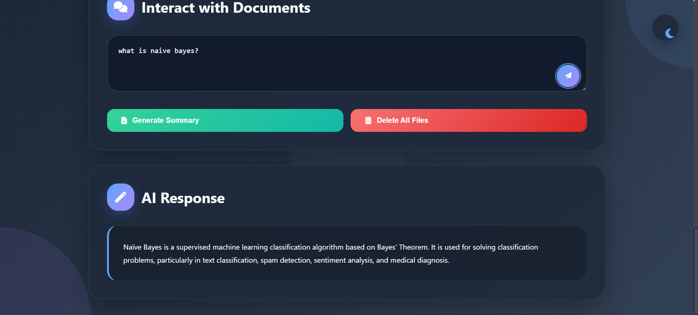
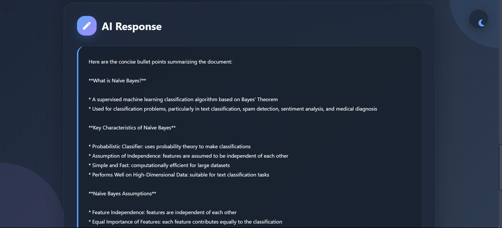

# 📄 QueryNest – Document AI Assistant

QueryNest is a **Flask-based web application** that allows users to upload documents (PDF, Word, Excel) and interact with them using **AI-powered Question Answering (QA)**.  
The system leverages the **Gemini LLM** and **vector embeddings (via LlamaIndex + HuggingFace Sentence-Transformers)** to extract **context-aware, semantic answers** directly from uploaded files.

---

## ✨ Features

- 📂 **Document Upload**: Upload PDF, Word (.docx), and Excel (.xlsx) files.  
- 🤖 **LLM-Powered QA**: Uses **Gemini API (1.5 Flash model)** for intelligent, context-driven answers.  
- 🔍 **Semantic Search**: Employs **LlamaIndex + HuggingFace embeddings** for efficient document indexing & retrieval.  
- 💬 **Chat History**: Supports multi-turn interaction with a scrollable chat UI.
- ✍️ **Markdown Rendering**: Rich text formatting for AI responses (bolding, lists, code blocks, etc.).
- 🌐 **Interactive UI**: Drag-and-drop upload interface with a smooth user experience.  
- 📱 **Responsive Design**: Works seamlessly across desktop and mobile devices.  
- 📑 **Multi-format Support**: Process text-rich files across multiple formats in one unified system.  

---

## 🧠 How the RAG Pipeline Works

QueryNest is built on a modern **Retrieval-Augmented Generation (RAG)** architecture using **LlamaIndex**. Here is the step-by-step breakdown of how it processes your documents:

1. **Document Ingestion & Text Extraction**: When a user uploads a document, the backend parses the raw text based on the file type (`PyPDF` for PDFs, `python-docx` for Word, and `pandas` for Excel). All text is combined into a unified format.
2. **Chunking / Node Creation**: The extracted text is not fed directly into the LLM (which would overwhelm the token limit). Instead, **LlamaIndex** splits the text into smaller, overlapping chunks (nodes). By default, this ensures semantic concepts aren't cut in half.
3. **Embedding Generation**: Each text chunk is converted into a high-dimensional vector using the local HuggingFace embedding model (`sentence-transformers/all-MiniLM-L6-v2`).
4. **Vector Storage**: These vectors are indexed and stored in a **VectorStoreIndex**, enabling mathematical similarity comparisons.
5. **Retrieval & Querying**: When you ask a question, your query is also embedded into a vector. The system performs a **semantic search** against the document vectors to find the `top-k` (Top 5) most relevant chunks of text.
6. **LLM Synthesis**: The Top 5 text chunks are injected into the context window of the **Gemini 1.5 Flash** model alongside your original question. Gemini synthesizes these precise snippets to formulate an accurate, hallucination-free response!

---

## 🛠️ Tech Stack

### Backend
- Flask (Python)  
- LlamaIndex for semantic document indexing  
- HuggingFace Sentence-Transformers for embeddings  

### Frontend
- HTML, JavaScript, Custom Vanilla CSS  

### Document Processing
- PyPDF → PDF Parsing  
- python-docx → Word documents  
- pandas + openpyxl → Excel files  

### AI / ML
- Gemini API (1.5 Flash)  

---

## 🚀 Setup Instructions

### Prerequisites
- Python **3.9+**  
- Gemini API Key  

### Installation

Clone the repository:
```bash
git clone https://github.com/Aritrraa/Query-Nest---Document-RAG_AI-Assistant.git
cd Query-Nest---Document-RAG_AI-Assistant
```

Create a virtual environment and activate it:
```bash
python -m venv venv
source venv/bin/activate    # On Windows: venv\Scripts\activate
```

Install dependencies:
```bash
pip install -r requirements.txt
```

Create a `.env.local` file in the root folder with your API key:
```env
GEMINI_API_KEY=your_gemini_api_key_here
```

Run the app:
```bash
python app.py
```

Open in browser:
```
http://127.0.0.1:5000
```

---

## 🪴 Usage

### Upload a Document  
- Drag & drop or click to upload **PDF, Word, or Excel** files.  
- The file is processed and indexed for semantic search.  

### Ask Questions  
- Enter a query in the input box.  
- QueryNest finds the most relevant context and generates an answer using the **Gemini LLM**.  

### Generate Summaries  
- QueryNest can also create summaries of uploaded documents for quick insights.  

---

## 📂 Project Structure

```graphql
Query-Nest---Document-RAG_AI-Assistant/
│── app.py              # Main Flask app
│── templates/
│   └── index.html      # Frontend HTML template
│── uploads/            # Stores uploaded documents
│── requirements.txt    # Python dependencies
└── .env.local          # API key config
```

---

## 📋 Requirements

Main dependencies:
- flask  
- werkzeug  
- python-dotenv  
- llama-index  
- llama-index-llms-gemini
- sentence-transformers  
- pypdf  
- python-docx  
- pandas, openpyxl  

*(See requirements.txt for the full list)*

---

## 🖼️ Screenshots / Project Images

### 1️⃣ Project Overview  




### 2️⃣ Document Upload  


### 3️⃣ Processing & Indexing  


### 4️⃣ Ask Questions (QA Interface)  


### 5️⃣ Document Summary Generation  


---

## ⚡ Limitations

- Free hosting plans (e.g., Netlify/Render) have **512MB RAM limit** → large LLMs may fail.  
- Processing **large documents** takes longer to embed & query.  
- Answer quality depends on **document clarity + LLM capability**.  

---

## 🔮 Future Improvements

- Support for multiple LLMs (OpenAI GPT, Groq, etc.).  
- Implement **user authentication & document history**.  
- Optimize for **larger documents & faster indexing**.  

---


## 🙏 Acknowledgements

- Google Gemini API  
- LlamaIndex  
- HuggingFace Transformers  

---

---

## 👨💻 Author

**Aritra Das**  
🚀 Developer of QueryNest · Document AI Assistant  

- 🌐 [GitHub](https://github.com/Aritrraa)  
- 💼 [LinkedIn](https://www.linkedin.com/in/aritra-das-6b5b89231/)  
